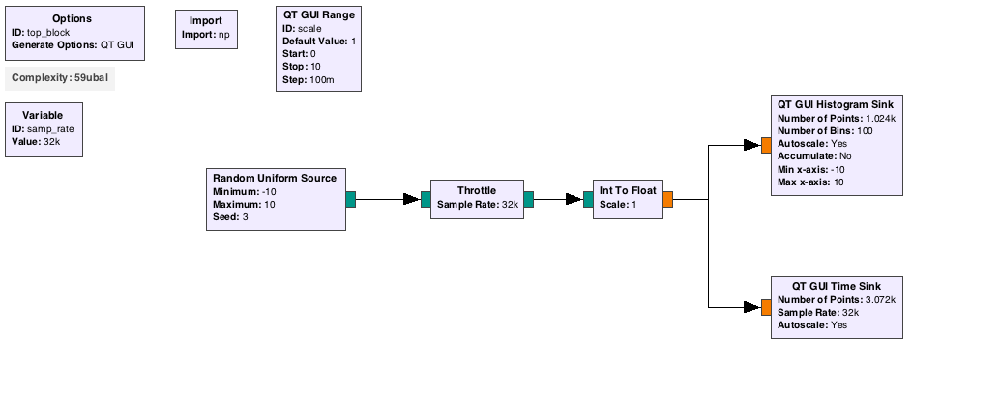

# Random Signals and Sampling

## Random Discrete Signals

Random signals are signals where the next value can be though of as chips
drawn from a hat with many many values, where the exact number of chips with those values relative to eachother can be given by an equation, the 'distribution'.  One of the simplest is a uniform random signal, where each value has an equal number of chips.  

In GnuRadio we can create these signals with a 'Random Uniform Source' block.

A very common distribution in nature is the 'gaussian' distribution.  

## Sampling

Sampling can always be though of as the act of pulling the chips out of the hat, and rounding the value on the chip to the nearest integer. When a real signal is digitized by an analog to digital converter (ADC), every clock cycle, the level of the signal is measured and recorded to the nearest value.

## Histograms

A histogram is a plot of the number of occurances of the signal that occur between a set of levels chosen.  Plotting the histogram is a way of trying to measure the distribution of an incoming random signal.  

## GnuRadio Companion Example.  

Create the shown GnuRadio flowgraph.  
 

Use a random source between -10 and 10.  The random source only creates discrete integer values, so you also need and Int to Float block with a 'scale' which will multiply the incoming signal by the scale value.  

Run the flowgraph, with the scale factor at 1.  What does the time plot look like?  What does the histogram look like?  Now play with the scale factor.  Can the histogram have large gaps? Can you make the histogram look continuous?  What intuition do you gain from this about sampling a 'random' signal?  

Now also try different distribution sources.  Use the "Noise Source" block and set it to a gaussian distribution.  What does the timestream look like?  What about the histogram?

Now again use a cosine input signal as you've used in a previous excercise.  What does the timeseries look like?  The histogram?  A cosine signal is not very random.  What if instead, each measured point in time of the cosine was completely randomized (could also think of using a uniform random signal put through a cosine function)?  Would the histogram look any different?  This would also be a random signal, and has the functional form $\frac{A}{\sqrt{1-y^2}}$, which should agree with your histogram.  

