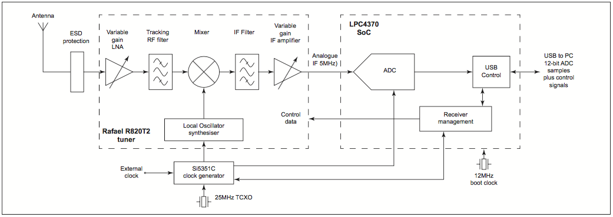
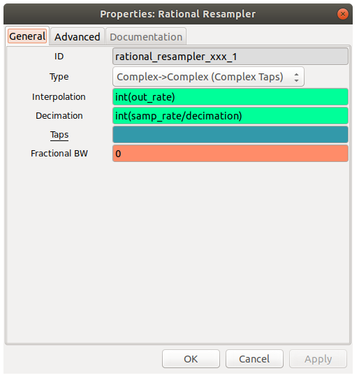
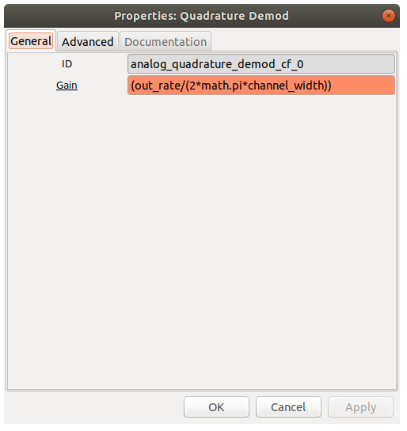
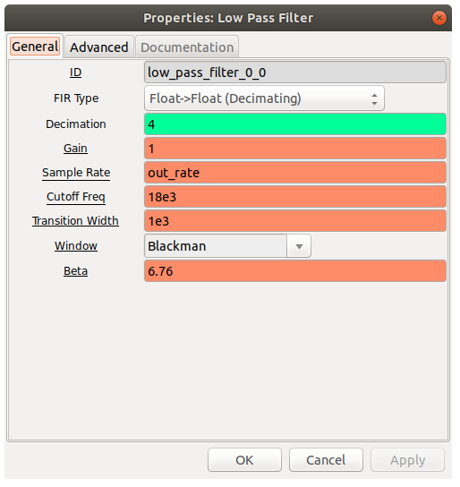

# 2. Software Defined Radio - Hardware

In [Lab 1](../01/) we learned how to work around GNU Radio Companion (GRC) and simulate signals and instruments. We shall now step into the real world with real signals. 

<!-- TOC -->

- [2. Software Defined Radio - Hardware](#2-software-defined-radio---hardware)
    - [2.1. Introduction](#21-introduction)
    - [2.2 Frequency Correction of the SDR Dongle](#22-frequency-correction-of-the-sdr-dongle)
    - [2.3. GNURadio FM](#23-gnuradio-fm)
        - [2.3.1 Signal Modulation](#231-signal-modulation)
            - [2.3.1.1 Amplitude Modulation](#2311-amplitude-modulation)
            - [2.3.1.2 Frequency Modulation](#2312-frequency-modulation)
        - [2.3.2 Let's Make our FM Radio](#232-lets-make-our-fm-radio)
    - [2.4. Fun SDR/GNU Radio things](#24-fun-sdrgnu-radio-things)

<!-- /TOC -->

## 2.1. Introduction

A "simplified" diagram of the device which we shall be using is shown below:

Simplifying this further for a general SDR hardware including the energy conversions:

(EM Waves)))) >-(Antenna)-->(Amplifier)--->(Local Oscillators + Filters)-->(Analog to Digital Convertor)-->(networking control: usually USB)--->[Computer]

Radio Waves excite electrons in the antenna and induces a current. The frequencies the antenna is most sensitive to is determined by the geometry of the antenna's design. The electric current is then initially amplified a bit. This amplifier is generally a "Low Noise Amplifier" because we want as little as possible in the antenna signal from the local electronics. Processing a signal at a fixed frequency gives a radio receiver improved performance so thus a local oscillator (LO) is used. It is an electronic oscillator used with a mixer to change the frequency of a signal. This frequency conversion process, also called heterodyning, produces the sum and difference frequencies from the frequency of the local oscillator and frequency of the input signal. The desired frequency is then filtered out and if required amplified again. The last step is the most crucial step where-in the signal is digitized to be sent to the computer to be manipulated by our gnuradio code!

[↑ Go to the Top of the Page](#)
## 2.2 Frequency Correction of the SDR Dongle

The hardware is well made, but a precision clock is quite expensive. The frequency the "tuner" tunes to may be slightly off from the actual frequency it is tuning to. We can correct for that in the software.  For high-end SDR dongles this correction is virtually non existent but some low-end dongles have higher deviations!

We can transmit a signal using a known and reliable tone. Then we use our receiver set up with gqrx to see the signal. If the incoming signal is exactly at the expected frequency then the intenral clock is working well. If not we look at the ``input controls`` tab in gqrx and change the ``freq. correction`` value until the peak is at the correct output.
 This value will be different for all dongles.  It also changes with the temperature of the dongle.  It is interesting to watch this change as the dongle warms up. Note your value for future purposes. 

[↑ Go to the Top of the Page](#)
## 2.3. GNURadio FM

We used gqrx in section 1.2 to listen to FM now we shall code our own radio using GRC!

### 2.3.1  Signal Modulation

Modulation is a process of mixing a signal with a sinusoid to produce a new signal. Consider a signal represented by the function: 

$$
f(t) = A \sin(\omega t + \phi).
$$

This sinusoid has 3 variables that can be altered ti change the function f(t). The first term, A, is called the magnitude, or amplitude of the sinusoid. The next term, $$\omega$$ is known as the frequency, and the last term, $$\phi$$ is known as the phase angle. We can encode our message in either of these three parameters.

The sinusoidal signal that is used in the modulation is known as the carrier signal, or simply "the carrier". The signal that is used in modulating the carrier signal (or sinusoidal signal) is known as the "data signal" or the "message signal".

In other words we can say that modulation is used because some data signals are not always suitable for direct transmission, but the modulated signal may be more suitable.

It follows  from above we encode in the above three variables. Consequently, we have 3 basic types of analog modulation:

- Amplitude Modulation
- Frequency Modulation
- Phase Modulation

#### 2.3.1.1 Amplitude Modulation

For our discussion of amplitide modulation consider a carrier wave of frequency $$f_c$$ and amplitude $$A$$ given by:

$$
c(t) = A \cdot \sin(2 \pi f_c t).
$$

Let $$m(t)$$ represent the modulation waveform. For this example we shall take the modulation to be simply a sine wave of a frequency $$f_m$$, a much lower frequency (such as an audio frequency) than $$f_c$$:

$$
m(t) = M\cdot \cos(2 \pi f_m t + \phi), 
$$

where $$M$$ is the amplitude of the modulation. If $$M>1$$ then overmodulation occurs and reconstruction of message signal from the transmitted signal would lead in loss of original signal. Amplitude modulation results when the carrier $$c(t)$$ is multiplied by the positive quantity  $$(1+m(t))$$:

$$
y(t) = [1 + m(t)]\cdot c(t) \\
\ \ = [1 + M\cdot \cos(2 \pi f_m t + \phi)] \cdot A \cdot \sin(2 \pi f_c t)
$$

Using trigonometric identities, $$y(t)$$ can be shown to be the sum of three sine waves:

$$
y(t) = A \cdot \sin(2 \pi f_c t) + \frac{AM}{2} \left[\sin(2 \pi (f_c + f_m) t + \phi) + \sin(2 \pi (f_c - f_m) t - \phi)\right]
$$

Therefore, the modulated signal has three components: the carrier wave $$c(t)$$ which is unchanged, and two pure sine waves (known as sidebands) with frequencies slightly above and below the carrier frequency $$f_c$$.

Demodulation or extracting the message from the carrier involves simply filtering out the carrier signal. We can construct an AM radio reciever on GNU radio however our SDR dongle can only tune from ~20 MHz to ~1800 MHz. 

#### 2.3.1.2 Frequency Modulation

As the name suggests the message signal is encoded in the frequency variable of the carrier signal as in $$x(t) = a \sin (f(t)t + \phi) $$. If the information to be transmitted (i.e., the data/message signal is $$x_m(t)$$ and the sinusoidal carrier is $$x_c(t) = A_c \cos (2 \pi f_c t)$$, where $$f_c$$ is the carrier's base frequency, and $$A_c$$ is the carrier's amplitude, the modulator combines the carrier with the data/message signal to get the transmitted signal

$$
\begin{align} 
y(t) & = A_c \cos \left( 2 \pi \int_{0}^{t} f(\tau) d \tau \right) \\ 
     & = A_{c} \cos \left( 2 \pi \int_{0}^{t} \left[ f_{c} + f_{\Delta} x_{m}(\tau) \right] d \tau \right)\\ 
     & = A_{c} \cos \left( 2 \pi f_{c} t + 2 \pi f_{\Delta} \int_{0}^{t}x_{m}(\tau) d \tau \right) \\ 
\end{align}
$$

where $$f_{\Delta} = K_f \cdot A_m $$ , $$K_f$$ being the sensitivity of the frequency modulator and $$A_m$$ being the amplitude of the modulating signal.
### 2.3.2 Let's Make our FM Radio

One way to demodulate the signal is to extract the message encoded in the frequency of the sinusoid outside the sinusoid. That can be achieved by differenting the sine wave. Consider the following:

$$
x(t) = a \sin (f(t)t + \phi) \\
\frac{d x(t)}{dt} = af(t) \cos(f(t)t + \phi) \\
\ \ \  = A(t) \cos(f(t) + \phi)
$$

For the FM signal 

$$
y(t) = A_c \cos ( 2 \pi f_c t + 2 \pi f_{\Delta} \int_{0}^{t} x_{m} (\tau) d \tau ) \\
 \ \ \  = A_c cos \theta(t)
$$

$$
\begin{align} 
y'(t) & = -A_c \theta ' (t) \sin \theta (t) \\
    & = -2 \pi A_c ( f_c + f_{\Delta} x(t) ) \sin \theta (t)
\end{align}
$$

We observe that we converted the FM signal into the form $$ y(t) = [1 + m(t)]\cdot c(t) $$ which is an AM signal. We can easily demodulate this AM signal by filtering out the AM "carrier". It follows the following flow:

FM ---->|Differentiator|---->|Envelope Detector|----> Signal

A simliar operation can be achieved in GNU radio using the following flow:

FM ---> |Filter out the signal of interest| ---> |Resample Signal| ---> |Quadrature Demodulator|--->|Lowpass Filter| ---> Audio Signal

**Hints:**

**Source**: Since we are using a hardware source we have to use the appropriate block. Search for the ``osmocom Source`` block. The Device arguments should be ``airspy=0``. **NOTE: The Sample rate supported by this dongle is either 2.5 MHz or 10 MHz. We shall set our ``samp_freq`` variable to ``2500000``**. The ``Ch0: Frequency (Hz)`` is the frequency you want to tune to. 

**Low Pass Filter**: This filters out all the frequencies apart from the one we want to tune our radio to. Note that I have another variable called ``channel_width`` which is equal to ``200e3``. It is to filter out at a data rate 200kHz. 

 
**Resampling Signal**: Use the 'Rational Resampler' block. Resample the signal such that the frequency of the signal is a multiple of out output frequency. The output frequency ( 'out_rate') is the frequency at which the sound card accepts samples i.e. 48 kHz to play audio. The output frequency should still be near to the bandwhith of the message i.e. 200kHz. 192kHz ie 'out_rate' is the closest multiple of 48kHz to it. As noticed on the screen shot here is a new variable 'decimation == int(samp_rate/(2*channel_width))' 

**Quadrature demodulation**: This block extracts the time dependend frequency component of the signal which is the audio signal.
   *use the quad demod block and fill in '(out_rate/(2*math.pi*channel_width))' in the gain field*

**Lowpass Filter**: Use a lowpass filter with the cutoff frequency at 18 kHz ( because human audio perfecption has an upper limit close to it). Enter the decimation value to downsample the signal coming in from 192kHz to 48kHz the rate at which the sound card works. 

**_Play audio from an audio sink_**

Lets capture some sweet tunes! 

<!--
Our FM Radio design GRC in its most basic has the following flow:

[Source]--(Low Pass Filter)---(Resampler)--(FM demodulator)---(Volume Gain)---[Audio Sink]

Find the corresponding blocks and connect them according to the flow given above. Use appropraite variables and GUI elements. USe the QT GUI Sink to visually show the signal in the flow before and after modulation. 

*Hints for reference*

**Source**: Since we are using a hardware source we have to use the appropriate block. Search for the ``osmocom Source`` block. The Device arguments should be ``airspy=0``. **NOTE: The Sample rate supported by this dongle is either 2.5 MHz or 10 MHz. We shall set our ``samp_freq`` variable to ``2500000``**. The ``Ch0: Frequency (Hz)`` is the frequency you want to tune to. 

**Low Pass Filter**: This filters out all the frequencies apart from the one we want to tune our radio to. Note that I have another variable called ``channel_width`` which is equal to ``200e3``. It is to filter out at a data rate 200kHz. 

**Resampler**: We are attempting to change the data rate to 480kHz which is 10 times (a nice multiple of) the soundcard's working frequency for all audio data files, and will still contain all the information left after we filtered to 200kHz. We do this because the sample rate is 2.5MHz and 480kHZ is not divisor of it i.e. they aren't integral multiples ( 2.5MHz/480kHz = 5.208).  Continuing the resampling we started earlier. we 'decimate' the input by dividing ``5`` and 'interpolate' it by mulitplying by ``12`` to resample to 480kHz!

**FM demodulator**: This is the most important part of the radio, well, it is essentially the radio as it decodes the signals to audio!

**Volume Gain**: Raise the roof people! It's a simple multiply constant block.

**Audio Sink**: To listen to the sweet tunes!

The choices made so far here may seem a bit arbitrary.  In the future we'll go into filters and filter design, and you can return to your FM radio, and possibly improve it!
-->

[↑ Go to the Top of the Page](#)

## 2.4. Fun SDR/GNU Radio things

1. AM Radio! (see above)
2. Narrow Band FM ( same are FM but a narrower filter passband)
3. [Listen to and get airplain ADS-B data](http://www.rtl-sdr.com/adsb-aircraft-radar-with-rtl-sdr/)
To chekc it out on your own get this software: [dump1090](https://github.com/MalcolmRobb/dump1090) 
4. Listen to HAM radio chatter ( usually amplitude modulated )
5. EMS and police and local services radio. [local scanners and frequencies](https://www.radioreference.com/apps/db/)
6. WeatherFAX. Get latest images of weather data from naval bases! [http://www.rtl-sdr.com/receiving-weather-rtty-rtl-sdr/](http://www.rtl-sdr.com/receiving-weather-rtty-rtl-sdr/)  
7. Get satellite data (Receive and decode live satellite images of earth):
 These satellite transmit that these frequencies:
NOAA 15 – 137.6200 MHz
NOAA 18 – 137.9125 MHz
NOAA 19 – 137.1000 MHz

8. If transmitted nearby get a newspaper over the radio!
9. [Decode high definition radio](http://theori.io/research/nrsc-5-c)
10. Build your own radio astronomy observatory! ( ok we are totally doing that!)

[↑ Go to the Top of the Page](#) ......[Next Lab](../03)
