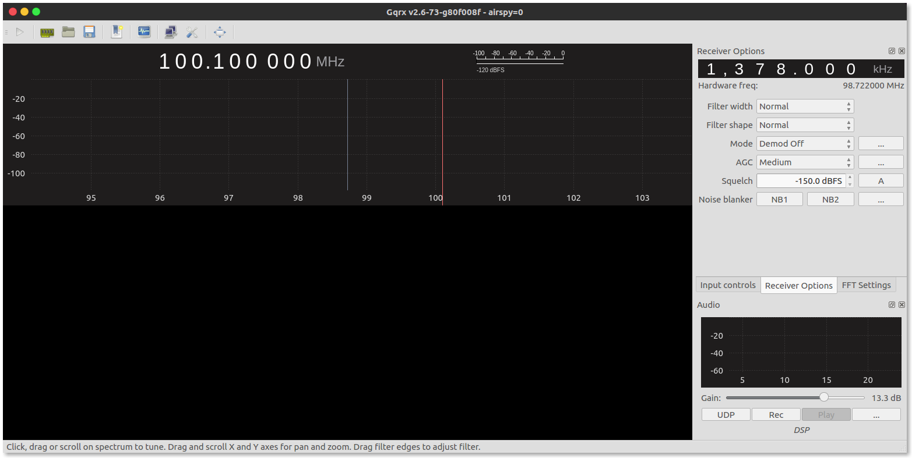
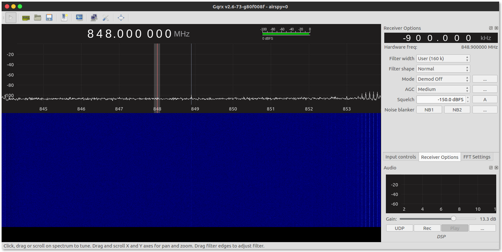
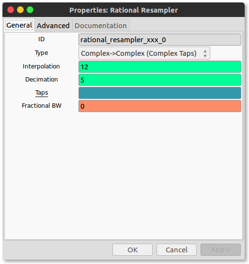

# 1. Software Defined Radio - Hardware

In [Lab 1](../01/) we learnt how to work around GNU Radio Companion (GRC) and simulate signals and instruments. We shall now step into the real world with real signals. 

<!-- TOC -->

- [1. Software Defined Radio - Hardware](#1-software-defined-radio---hardware)
    - [1.1. Introduction](#11-introduction)
    - [1.2. GQRX - It's cool](#12-gqrx---its-cool)
        - [1.2.1. Frequency Correction](#121-frequency-correction)
    - [1.3. GNURadio FM](#13-gnuradio-fm)
    - [1.4. Fun SDR/GNU Radio things](#14-fun-sdrgnu-radio-things)

<!-- /TOC -->

## 1.1. Introduction

A "simplified" diagram of the device which we shall be using is shown below:

Simplying this further for a general SDR hardware including the energy converstions:

(EM Waves)))) >-(Antenna)-->(Amplifier)--->(Local Oscillators + Filters)-->(Analog to Digital Convertor)-->(networking control: usually USB)--->[Computer]

Radio Waves excite electrons in the antenna and induces a current. The frequencies the antenna is most sensitive to is determined by the geometry of the antenna's design. The electric current is then initially amplified a bit. This amplifier is generally a "Low Noise Amplifier" because we do not want any new insertions into out antenna signal from the local electronincs. Processing a signal at a fixed frequency gives a radio receiver improved performance so thus a local oscillator (LO) is used. It is an electronic oscillator used with a mixer to change the frequency of a signal. This frequency conversion process, also called heterodyning, produces the sum and difference frequencies from the frequency of the local oscillator and frequency of the input signal. The desired frequency is then filterd out and if required amplified again. The last step is the most crucial step where-in the signal is digitized to be sent to the computer to be maniplated by our gnuradio code! 

Before we code on our own we shall this useful application called GQRX

## 1.2. GQRX - It's cool

[GQRX](http://gqrx.dk) is an application written is gnuradio. It acquired data from the dongle and has a set of preset options to manipulate said signals. It can even store raw data for custom decoding.

First, we make sure our dingle is plugged into the USB see if it is detected by the computer by typing  ``airspy_info``. If we installed all software correctly it should return information about the dongle and no errors. If everything is in order the type in terminal:

``
gqrx
``

It will open a window that looks like this. 

 If you are using for the first time the hardware setting window/(IO setting) should open automatically and also automatically detect the dongle if not chose ``AirSpy AIRSPY`` from the drop down. 
Else you canb open it by clicking on the "circuit board" icon next to the play triangle. The I/O device settings shoud look like this:

Once it is all in order click play. The window should show the spectrum as such:

Hit play. Change the frequency to 100Mhz. Notice the bright bands on the waterfall and the peaks, these are local FM stations

Since the sample rate is very high (a feature of this particular hardware). We click on the "circuit board" button again and change input rate 2500000 (from the drop down). In the receiver options the right change ``Mode`` to ``WFM`` ( wideband FM ) from the drop down and et voila old timey over-the-air radio on your space-age computer.

We can use this application to recieve even decode to all kinds of signals from 24 – 1800 Mhz. Check out [Section 1.4](#14-fun-sdrgnu-radio-things)

### 1.2.1. Frequency Correction

The hardware ususally well made but sometimes errors slip through. The frequency the "tuner" tunes to may be every slightly off from the actaull frequency it is tuning to. We can correct for that in the software.  For high hend SDR dongles this correction is virtually non existent but some low-end dogles have higher deviations!

We can transmit a signal using a known and relaiable tone. Then we use our receiver set up with gqrx to see the signal. If the incoming signal is exactly at the expected frequency. If not we look at the ``input controls`` tab in gqrx and change the ``freq. correction`` value until the peak is at the correct output.
 Note this value for future purposes. This value will be different for all dongles.

## 1.3. GNURadio FM

We used gqrx in section 1.2 to listen to FM now we shall code our own radio using GRC!

First things first, FM stands for frequency modulation i.e. the information is coded into the frequecy variable of the signal. [^FM]

[^FM]: Read more about it in the [wikipedia article](https://en.wikipedia.org/wiki/Frequency_modulation) and a quick internet search or a peak into a basic signals textbook would have more relevant info.

Our FM Radio design GRC in its most basic has the following flow:

[Source]--->(Low Pass Filter)--->(Resampler)-->(FM demodulator)--->(Volume Gain)--->[Audio Sink]

Find the corresponding blocks and connect them according to the flow given above. Use appropraite variables and GUI elements. USe the QT GUI Sink to visually show the signal in the flow before and after modulation. 

*Hints for reference*

**Source**: Since we are using a hardware source we have to use the appropriate block. Search for the ``osmocom Source`` block. The Device arguments should be ``airspy=0``. **NOTE: The Sample rate supported by this dongle is either 2.5 MHz or 10 MHz. We shall set our ``samp_freq`` variable to ``2500000``**. The ``Ch0: Frequency (Hz)`` is the frequency you want to tune to. 

**Low Pass Filter**: This filters out all the frequencies apart from the one we want to tune our radio to. Note that I have another variable called ``channel_width`` which is equal to ``200e3``. It is to filter out at a data rate 200kHz. We are attempting to change the data rate to 480kHz which is the soundcard's working frequency for all audio data files. We do this because the sample rate is 2.5MHz and 480kHZ is not divisor of it i.e. they aren't integral multiples ( 2.5MHz/480kHz = 5.208).  

**Resampler**: Continuing the resampling we started earlier. we 'decimate' the input by dividing ``5`` and 'inerpolate' it by mulitplying by ``12`` to resample to 480kHz!

**FM demodulator**: This is the most important part of the radio, well, it is essentially the radio as it decodes the signals to audio!

**Volume Gain**: Raise the roof people! It's a simple multiply constant block. 

**Audio Sink**: To listen to the sweet tunes!

## 1.4. Fun SDR/GNU Radio things

1. AM Radio!
2. Listen to and get airplain ADS-B data
3. Listen to HAM radio chatter
4. EMS and police and local services radio.
5. WeatherFAX. Get latest images of weather data from naval bases! 
6. Get satellite data
7. Recieve and decode live satellite images of earth
8. If transmitted nearby get a newspaper over the radio!
9. Build your own radio astronomy observatory! ( ok we are totally doing that!)
