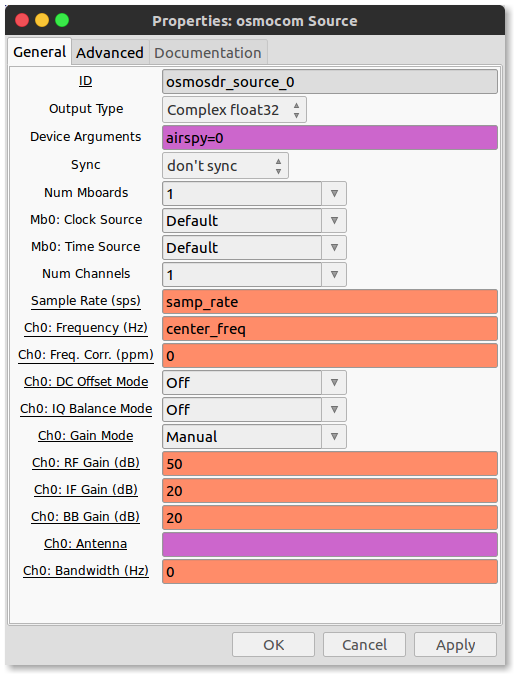
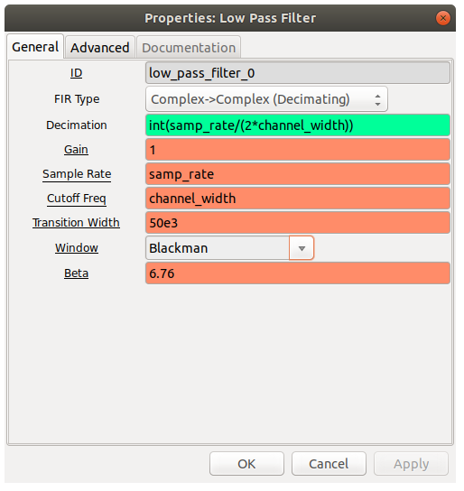

# 2. Software Defined Radio - Hardware

In [Lab 1](../01/) we learned how to work around GNU Radio Companion (GRC) and simulate signals and instruments. We shall now step into the real world with real signals. 

<!-- TOC -->

- [2. Software Defined Radio - Hardware](#2-software-defined-radio---hardware)
    - [2.1. Introduction](#21-introduction)
        - [2.1.1. Frequency Correction of the SDR Dongle](#211-frequency-correction-of-the-sdr-dongle)
    - [2.3. GNURadio FM](#23-gnuradio-fm)
    - [2.4. Fun SDR/GNU Radio things](#24-fun-sdrgnu-radio-things)

<!-- /TOC -->

## 2.1. Introduction

A "simplified" diagram of the device which we shall be using is shown below:

Simplifying this further for a general SDR hardware including the energy conversions:

(EM Waves)))) >-(Antenna)-->(Amplifier)--->(Local Oscillators + Filters)-->(Analog to Digital Convertor)-->(networking control: usually USB)--->[Computer]

Radio Waves excite electrons in the antenna and induces a current. The frequencies the antenna is most sensitive to is determined by the geometry of the antenna's design. The electric current is then initially amplified a bit. This amplifier is generally a "Low Noise Amplifier" because we want as little as possible in the antenna signal from the local electronics. Processing a signal at a fixed frequency gives a radio receiver improved performance so thus a local oscillator (LO) is used. It is an electronic oscillator used with a mixer to change the frequency of a signal. This frequency conversion process, also called heterodyning, produces the sum and difference frequencies from the frequency of the local oscillator and frequency of the input signal. The desired frequency is then filtered out and if required amplified again. The last step is the most crucial step where-in the signal is digitized to be sent to the computer to be manipulated by our gnuradio code! 

Before we code on our own we shall a useful application called GQRX

[↑ Go to the Top of the Page](#)

### 2.1.1. Frequency Correction of the SDR Dongle

The hardware is well made, but a precision clock is quite expensive. The frequency the "tuner" tunes to may be slightly off from the actual frequency it is tuning to. We can correct for that in the software.  For high hend SDR dongles this correction is virtually non existent but some low-end dongles have higher deviations!

We can transmit a signal using a known and reliable tone. Then we use our receiver set up with gqrx to see the signal. If the incoming signal is exactly at the expected frequency. If not we look at the ``input controls`` tab in gqrx and change the ``freq. correction`` value until the peak is at the correct output.
 This value will be different for all dongles.  It also changes with the temperature of the dongle.  It is interesting to watch this change as the dongle warms up. Note your value for future purposes. 

[↑ Go to the Top of the Page](#)

## 2.3. GNURadio FM

We used gqrx in section 1.2 to listen to FM now we shall code our own radio using GRC!

First things first, FM stands for frequency modulation i.e. the information is coded into the frequecy variable of the signal. [^FM]

[^FM]: Read more about it in the [wikipedia article](https://en.wikipedia.org/wiki/Frequency_modulation) and a quick internet search or a peak into a basic signals textbook would have more relevant info.

Our FM Radio design GRC in its most basic has the following flow:

[Source]--->(Low Pass Filter)--->(Resampler)-->(FM demodulator)--->(Volume Gain)--->[Audio Sink]

Find the corresponding blocks and connect them according to the flow given above. Use appropraite variables and GUI elements. USe the QT GUI Sink to visually show the signal in the flow before and after modulation. 

*Hints for reference*

**Source**: Since we are using a hardware source we have to use the appropriate block. Search for the ``osmocom Source`` block. The Device arguments should be ``airspy=0``. **NOTE: The Sample rate supported by this dongle is either 2.5 MHz or 10 MHz. We shall set our ``samp_freq`` variable to ``2500000``**. The ``Ch0: Frequency (Hz)`` is the frequency you want to tune to. 

**Low Pass Filter**: This filters out all the frequencies apart from the one we want to tune our radio to. Note that I have another variable called ``channel_width`` which is equal to ``200e3``. It is to filter out at a data rate 200kHz. 

**Resampler**: We are attempting to change the data rate to 480kHz which is 10 times (a nice multiple of) the soundcard's working frequency for all audio data files, and will still contain all the information left after we filtered to 200kHz. We do this because the sample rate is 2.5MHz and 480kHZ is not divisor of it i.e. they aren't integral multiples ( 2.5MHz/480kHz = 5.208).  Continuing the resampling we started earlier. we 'decimate' the input by dividing ``5`` and 'interpolate' it by mulitplying by ``12`` to resample to 480kHz!

**FM demodulator**: This is the most important part of the radio, well, it is essentially the radio as it decodes the signals to audio!

**Volume Gain**: Raise the roof people! It's a simple multiply constant block.

**Audio Sink**: To listen to the sweet tunes!

The choices made so far here may seem a bit arbitrary.  In the future we'll go into filters and filter design, and you can return to your FM radio, and possibly improve it!

[↑ Go to the Top of the Page](#)

## 2.4. Fun SDR/GNU Radio things

1. AM Radio!
2. Narrow Band FM ( same are FM but a narrower filter passband)
3. [Listen to and get airplain ADS-B data](http://www.rtl-sdr.com/adsb-aircraft-radar-with-rtl-sdr/)
To chekc it out on your own get this software: [dump1090](https://github.com/MalcolmRobb/dump1090) 
4. Listen to HAM radio chatter ( usually amplitude modulated )
5. EMS and police and local services radio. [local scanners and frequencies](https://www.radioreference.com/apps/db/)
6. WeatherFAX. Get latest images of weather data from naval bases! [http://www.rtl-sdr.com/receiving-weather-rtty-rtl-sdr/](http://www.rtl-sdr.com/receiving-weather-rtty-rtl-sdr/)  
7. Get satellite data (Receive and decode live satellite images of earth):
 These satellite transmit that these frequencies:
NOAA 15 – 137.6200 MHz
NOAA 18 – 137.9125 MHz
NOAA 19 – 137.1000 MHz

8. If transmitted nearby get a newspaper over the radio!
9. [Decode high definition radio](http://theori.io/research/nrsc-5-c)
10. Build your own radio astronomy observatory! ( ok we are totally doing that!)

[↑ Go to the Top of the Page](#) ......[Next Lab](../03)
