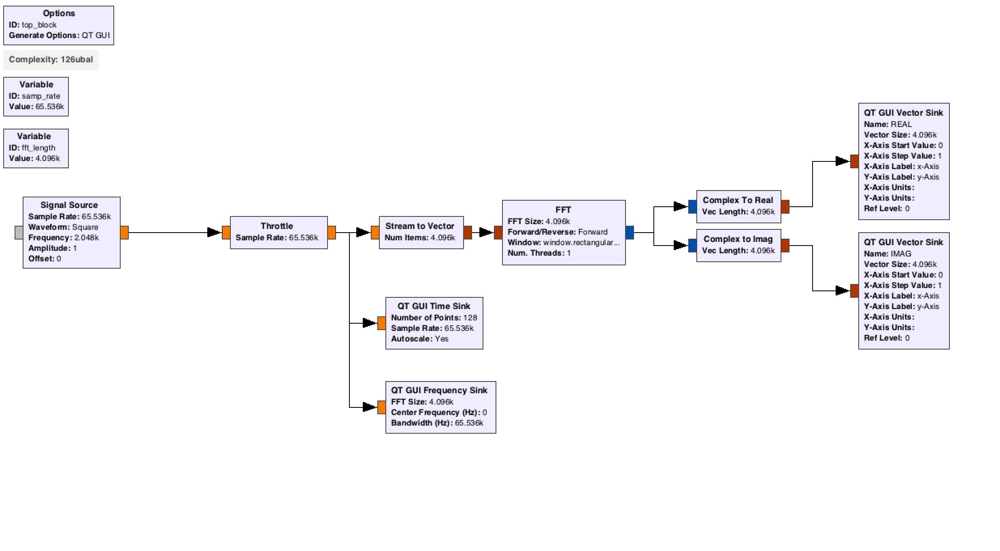

<!--

## 1.6. Find the fourier series for:

1.  Sqaure Wave
2.  Triangular Wave
3.  Sawtooth Wave

We can use gnuradio-companion to graphically figure out what the fourier components should be using a fourier transform.  Create a flow-graph with a signal source->FFT(fourier transform)-> complex to real/imag -> vector sinks.  The output of the real-part contains the cosine components of the transform.  The imaginary part contains the sine components of the fourier expansion.  

It is also helpful to plot the timeseries to see what your input is and the frequency sink to make it easier to just read off the frequency of the components.  

An example flowgraph looks like:
 
-->