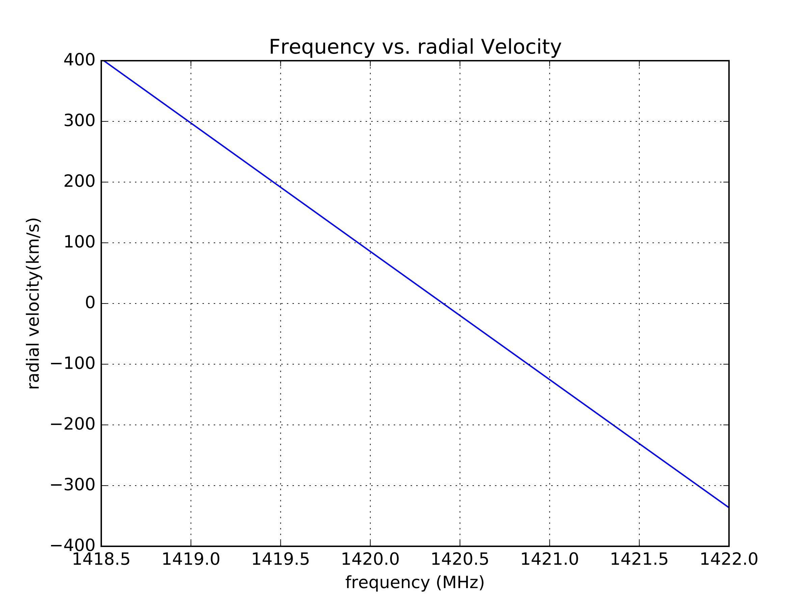
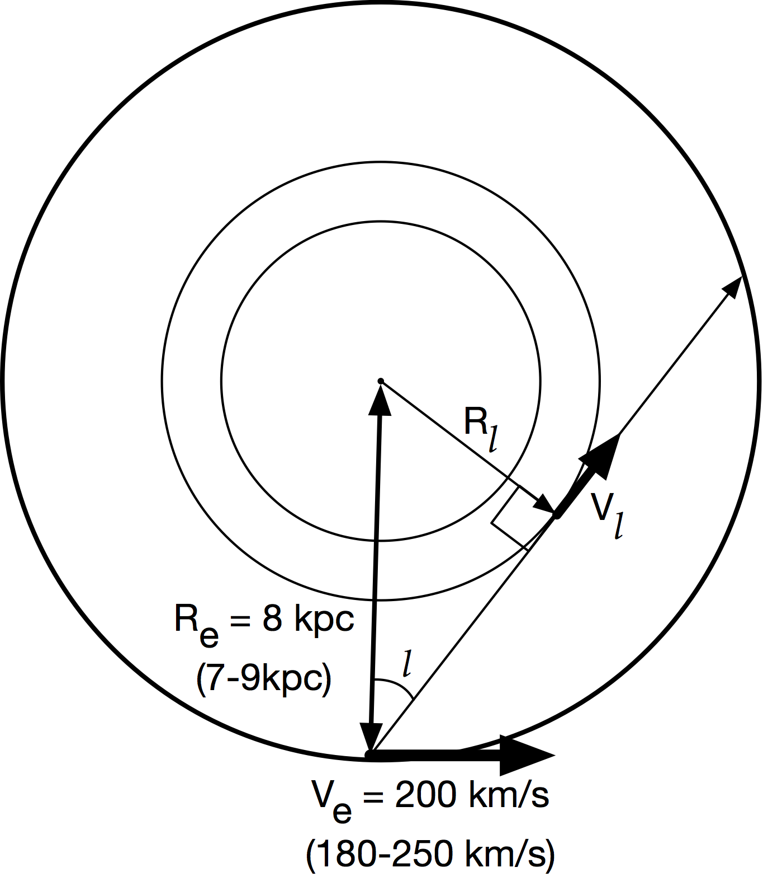

# A Radio Telescope

That's been a lot of Digital Signal Processing so let us just go ahead and build our radio telecope already!

<!-- TOC -->

- [A Radio Telescope](#a-radio-telescope)
    - [6.1. Horn Antenna](#61-horn-antenna)
    - [6.2  21cm Low Noise Amplifier](#62--21cm-low-noise-amplifier)
    - [6.3 Spectrometer.](#63-spectrometer)
    - [6.4  Observe.](#64--observe)
        - [6.4.1 Data Reduction](#641-data-reduction)
    - [6.5 Milky Way Rotation Curve.](#65-milky-way-rotation-curve)
        - [6.5.1 From Frequency to Velocity](#651-from-frequency-to-velocity)
        - [6.5.2 From Velocities relative to us to relative to the Milky Way center.](#652-from-velocities-relative-to-us-to-relative-to-the-milky-way-center)

<!-- /TOC -->

## 6.1. Horn Antenna 

We are building a special kind of radio telescope which uses a Horn Antenna. 

[Follow these intructions for Horn Assembly](DSPIRA_Horn_Assembly.pdf)

## 6.2  21cm Low Noise Amplifier

The Neutral Hydrogen signal from the Milky Way galaxy is very faint, and the telescope needs an amplifier that adds as little noise to the signal as possible.  We have designed a low noise amplifier for you to use which will add less than 50 Kelvin noise temperature to the incoming signal.  See the attached pdf for assembly instructions:

[LNA assembly Instructions](DSPIRA_LNA_assembly.pdf)

A brief memo on the initial design and performance of the LNA is here:

[LNA memo](DSPIRA_memo2_LNA.pdf)

## 6.3 Spectrometer.  

Use the spectrometer you designed in [Lab 5](../05)

You may want to upgrade your spectrometer to use a different output than just a standard binary data file (which you'll have to know ahead of time how to interpret).

You can use an out-of-tree module to instead save the data to an HDF5 file, which will then include additional information about what the data is, to help interpretation. Follow the instructions from the readme file at this website:
[gnuradio OOT radio astronomy package ](https://github.com/WVURAIL/gr-radio_astro)

1.) Clone the repository into an appropriate folder/repository: 

```bash
git clone https://github.com/WVURAIL/gr-radio_astro.git
```

2.) Go to the ``gr-radio_astro.git`` folder/repository, create a build directory inside the repository:

```bash
cd gr-radio_astro
mkdir build
```

3.)  run cmake inside the build directory:

```bash
cd build;  cmake ..
```

4.) run make inside build directory

```bash
make
```

5.)  If no errors, install

```bash
make install
```

Blocks should now be available in gnuradio-companion.
 
 **Additionally install h5py**
 
 ```bash
 sudo pip install h5py
 ```


Blocks should now be available in gnuradio-companion, in the 'radio_astro' section.


## 6.4  Observe.

### 6.4.1 Data Reduction

Depending on the kind of sink you use you have different kind of data formats - if you used the file sink defualt block the data is saved with``float32`` data in 4096 point vectors encoded in binary. You can reduce that data as follows:

Open IPython from the folder/directory where your data is saved:

```bash
ipython --pylab
```

```python

##########################
## Read and reshape data
##########################

spec1 = np.fromfile("data",dtype=np.float32) # open 'data' in read mode and put all the data as a numpy array spec
spec1.shape # .shape shows the array dimension.shape
spec = spec.reshape((-1,4096)) # reshapes data into stacks of 4096 points
spec.shape # get the shape of the new array. The frst number is the number of time intgrations

###############################################
# save to a text file to open on excel or other
###############################################

np.savetxt("reshapeddata.csv",np.transpose(spec),delimiter=',') # saved to file reshapeddata.txt with a comma delimiter

##############################################
# Plot
############################################## 

plot(spec[0]) # plots the first integration
plot(spec[i]) # plots the i-th integration

```

If you used the Out-of-Tree Module ``hdf5_sink`` your data is in the hdf5 (heirarchichal data format) format. You can reduce it such: 

``` python 
##########################################
# Import h5py package to read hdf5 files
##########################################

import h5py

###########################################
# read file into a variable
###########################################

f = h5py.File('2017-07-19_16.12.50.h5','r')   

list(f.attrs)         # check the metadata attributes
list(f.attrs.items()) # check the metadata attributes and their values
f.items()             # list the datasets in the file

#############################################
# extract the spectrum data and 
#############################################

spectrum = f['spectrum'][:]          # get the spectrum data

###############################################
# save to a text file to open on excel or other
###############################################

np.savetxt("reshapeddata.csv",np.transpose(spectrum),delimiter=',') # saved to file reshapeddata.txt with a comma delimiter

############################################
# plot
############################################

fstart = f.attrs['freq_start']       # get the start frequency
fstep = f.attrs['freq_step']         # get the stop frequency 
flength = 4096                       # the number of points on the frequency axis, vector length
freq = np.arange(flength)*fstep + fstart         # make an array of x-axis indices
rcParams['axes.formatter.useoffset'] = False 
plot(freq, 10.0*np.log10(spectrum.mean(axis=0))) # log was taken before putting into the sink


```


## 6.5 Milky Way Rotation Curve.  
### 6.5.1 From Frequency to Velocity
The observations of the Neutral Hydrogen in the galaxy were made around its at rest frequency of 1420.40575177 MHz.  We observe it at different frequencies since it is moving relative to us in the galaxy.  We'll use the non-relativistic formula:

$$  \frac{ \lambda_o - \lambda_e}{\lambda_e} = \frac{\Delta \lambda}{\lambda} = \frac{v}{c} $$

where $$ \lambda_e $$ is the wavelength emitted, and $$ \lambda_o $$ is the wavelength observed.  To convert from frequency to wavelength, we can use the speed of light:
$$ c = \lambda f $$

to get:

$$ \frac{f_e - f_o}{f_o} c = v $$

where now $$f_e$$ is the frequency emitted, $$f_o$$ is the frequency observed, and c is the speed of light (300,000 km/s).

We can now convert our measurement of Power vs. frequency to Power vs. speed (use km/s) relative to us.  Does it matter what units are used for frequency?

See below for a plot of frequency vs. radial velocity for neutral hydrogen.




### 6.5.2 From Velocities relative to us to relative to the Milky Way center.  

What we want is the speed of the neutral hydrogen moving around the galactic center as a function of the distance away from the galactic center.  What we measure is not the velocity of the neutral hydrogen relative the galactic center, but instead relative to us along a given line of sight.  We can use as a given the speed of the earth around the galactic center as 200 km/s (current numbers are 180-250km/s) at a radius of 8 kpc (7-9 kpc).  (The speed of the earth around the sun is 30 km/s, so should be also taken into account for a more precise measurement, but we'll skip this for now.)

 

We'll use the *Tangent Point Method* to find the rotation speed at a given radius.  To do this, well assume that the fastest moving hydrogen along the line of sight for a given line of sight will be that which is closest to the center of the galaxy, since it will be also moving along the same line (See diagram).  With this assumption use the 'fastest' speed on a given line of sight (negative or positive) and convert it to a rotational velocity at that radius.  

The radius will be given by:

$$ R_l = R_e sin(l) $$

where $$ R_e $$ is the earth radius, and $$l$$ is the galactic longitude.  

The radial velocity will be given by:

$$ V_l = | V_{los} | + V_e sin(|l|) $$

Where $$ V_l $$ is the galactic rotational velocity, $$ V_{los} $$ is the maximal ( negative or positive ) velocity measured at that $$l$$, and $$ V_e $$ is the given earth radial velocity.  

You now have all the ingredients to create a plot of the galactic rotation curve for the Milky Way, plotting rotational velocity as a function of radial distance away from the center.  

What is the expected result?

